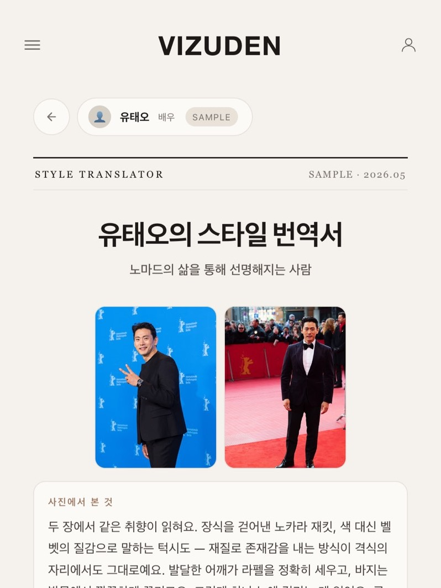

# VIZUDEN

<p align="center"><a href="https://vizuden.com/translator/report/ae7001d7-18c1-4d2a-b85e-44c037d04cfe"></a></p>

**[▶ VIZUDEN으로 이동하기](https://vizuden.com)** · **[샘플 보고서 보기](https://vizuden.com/translator/report/ae7001d7-18c1-4d2a-b85e-44c037d04cfe)**

VIZUDEN은 설문 응답을 AI로 분석해 남성 사용자에게 스타일 방향과 브랜드를 제안하는 서비스입니다. 혼자 기획·개발해 배포하고 베타 참여자에게 보고서를 제공했으며, 그중 4명과는 오프라인 피팅도 진행했습니다. 2026년 6월 중순 베타 운영을 끝으로 신규 운영을 중단하고 서비스는 유지보수 상태로 두었습니다.

## 목차 <!-- omit from toc -->

- [만든 것](#만든-것)
- [어떻게 돌아가나요?](#어떻게-돌아가나요)
- [신규 운영을 중단한 이유](#신규-운영을-중단한-이유)
- [배운 점](#배운-점)
- [유지보수에서 고친 것](#유지보수에서-고친-것)
- [기술 구성](#기술-구성)
- [로컬 실행](#로컬-실행)

## 만든 것

- **사용자 조사·기획:** 커피챗에서 확인한 패션 지식·옷 매칭·착용 상황의 고민을 바탕으로, 설문을 스타일 방향·브랜드·상황별 코디·예산 계획으로 바꾸는 Claude API 보고서 서비스를 기획·개발했습니다.
- **유형 진단:** 4개 축 12문항으로 16가지 유형을 알려 주는 무료 진입점입니다. 유형마다 다른 Open Graph 미리보기 16개를 빌드 때 정적 HTML로 만들어, SNS에 공유하면 유형별 카드가 보입니다.
- **개인화 보고서:** 유형 진단 결과와 보고서 답변을 입력으로 받고, 사용자가 쓴 표현을 그대로 인용하도록 프롬프트를 설계했습니다.
- **베타 운영:** 커뮤니티에서 베타 참여자를 모집해 보고서를 제공하고, 4명과 오프라인 피팅을 진행했습니다.

## 어떻게 돌아가나요?

처리 흐름은 설문 입력 → 검색 자료 수집 → Claude 보고서 생성·스트리밍 → 텍스트 윤문 → Supabase 저장 → 최종 보고서 표시입니다.

- **스트리밍:** 로컬 완료 사례 6건에서 생성 완료까지 102~128초가 걸렸습니다. 완성 전에도 읽을 수 있게 Claude API 응답을 SSE로 받아 완성된 섹션부터 순서대로 표시했습니다. 첫 화면 표시 시간이나 전체 생성 시간의 단축 효과는 측정하지 않았습니다.
- **파싱:** 응답 형식이 어긋났을 때 보고서를 읽을 수 있도록, JSON 파싱 실패 시 본문에서 JSON 구간을 다시 추출하는 폴백을 구현했습니다. 이 처리는 형식 오류에 대한 대응이며 추천 내용의 정확성을 검증하지는 않습니다.
- **로그인:** 설문을 바로 시작할 수 있도록 로그인을 요구하지 않았습니다. 끝난 뒤 로그인하면 게스트 세션에 쌓인 응답·보고서·피드백을 계정으로 옮깁니다. 인증은 Supabase 구글 OAuth를 썼고, 베타 운영용 어드민 대시보드도 함께 만들었습니다.
- **차트:** 예산 배분 하나를 보여 주려고 라이브러리를 들이지 않고 SVG 도넛 차트를 직접 그렸습니다.

## 신규 운영을 중단한 이유

중단하기로 판단한 근거는 세 가지였습니다.

1. **방향과 수요의 차이:** 저는 사람들이 옷 자체를 즐기게 만드는 서비스를 원했지만, 베타 참여자와 커피챗·피팅을 하며 만난 남성들에게 패션은 속한 무리에 어울리거나 이성에게 돋보이기 위한 도구에 가까웠습니다. 커피챗에서 들은 고민도 무엇부터 입어야 할지, 어떤 브랜드가 있는지, 상황마다 무엇을 입어야 할지처럼 실용적인 것이 중심이었습니다.
2. **개별 맞춤 추천의 어려움:** 옷으로 얻고 싶은 것이 사람마다 달라 추천도 개인에 맞춰야 했지만, 그러려면 직업이나 정체성과 브랜드·스타일을 잇는 지식 그래프가 필요했고 이런 데이터를 혼자 쌓기는 어려웠습니다. 그래서 추천이 LLM의 일반 지식에 기대 일반적인 답변으로 흐르기 쉬웠고, 설문 속 사용자 표현을 인용하도록 프롬프트를 설계해도 말투만 개인화될 뿐 추천의 근거는 되지 못했습니다.
3. **일회성 이용 구조:** 보고서를 받고 옷을 한 번 사거나 반응을 보인 뒤에는, 다시 찾아와 계속 쓰고 지출하게 만들 이유를 설계하기 어려웠습니다. 한 번 받으면 목적을 다하는 보고서의 성격상 반복 이용으로 이어질 장치가 필요했지만, 그 장치를 찾지 못했습니다.

## 배운 점

- **사용자 니즈의 우선순위화:** 공들여 만들어도 사용자가 원하지 않으면 서비스는 존재할 이유가 없습니다. 만들고 싶은 것보다 사용자가 필요로 하는 것을 먼저 확인해야 합니다.
- **고객에 대한 이해:** AI가 만능처럼 보여도 추천의 질은 결국 시장을 이루는 사람, 곧 고객의 취향과 맥락을 얼마나 이해하고 그 이해를 AI가 쓸 수 있는 데이터로 옮기느냐에 달려 있습니다.

## 유지보수에서 고친 것

- **완료 상태 불일치 수정:** 완료 직후 화면과 새로고침 후 화면이 202줄 중 9줄 다른 문제를 실제 화면·DB 대조로 발견했습니다. DB 저장 확인 뒤 완료를 알리고 화면을 최종 저장본으로 전환하도록 수정했고, Playwright로 로컬·배포 가상 사례 각 1건에서 화면 일치를 재확인했습니다.

## 기술 구성

React · JavaScript · Vite · Tailwind CSS · Anthropic API · Supabase · Vercel

`src/`는 화면과 상태 관리, `api/`는 서버리스 API, `api/_lib/`는 프롬프트·검색·인증 공통 로직입니다. DB 설정 SQL은 저장소 루트에 있습니다.

## 로컬 실행

Node.js 22.12 이상을 권장합니다.

```sh
npm ci
npm run dev
```

`.env.local`에 브라우저용 `VITE_SUPABASE_URL`, `VITE_SUPABASE_ANON_KEY`를 설정합니다.

**현재 Vite 개발 서버는 `/api` 요청을 기본적으로 운영 서비스로 전달합니다.** 로컬 API를 사용하려면 별도로 API 서버를 실행하고 `VITE_API_TARGET`을 해당 주소로 지정하세요.

서버 API에는 `ANTHROPIC_API_KEY`, `SUPABASE_URL`, `SUPABASE_SERVICE_ROLE_KEY`가 필요합니다. 검색 연동에는 `TAVILY_API_KEY`를 사용합니다. 실제 키는 커밋하지 않습니다.

```sh
npm run build
npm run preview
```

빌드에는 보고서 공유용 OG HTML 생성이 포함됩니다.
